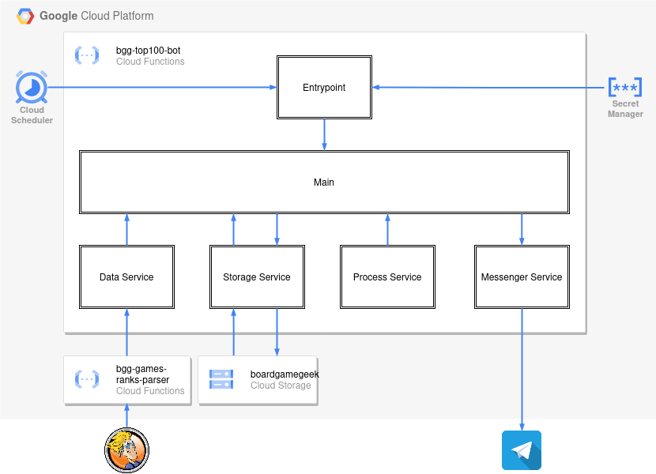

# BGG Top 100

This bot posts [BGG Top 100](https://boardgamegeek.com/browse/boardgame) list (with changes) to [@bggtop100](https://t.me/bggtop100) every week.

---

## Working locally

### 1. create and fill .env file (use .env.example for help)

### 2. start the project

You can start project as lambda function:

```bash
npm run start:dev
```

### 3. you can invoke the function locally

```bash
curl localhost:8080
```

## google cloud setup

### create bucket:

```bash
gcloud storage buckets create gs://boardgamegeek --location=us-central1
gcloud storage buckets update gs://boardgamegeek --versioning
```

### create schedulers

```bash
gcloud scheduler jobs create http bgg-top100-bot --location=us-central1 --schedule="0 9 * * 6" --uri="https://us-central1-zinovik-project.cloudfunctions.net/bgg-top100-bot?channelId=@bggtop100&isDevMode=off" --oidc-service-account-email=zinovik-project@appspot.gserviceaccount.com --http-method=get --oidc-token-audience="https://us-central1-zinovik-project.cloudfunctions.net/bgg-top100-bot"

gcloud scheduler jobs create http bgg-top100-bot-dev --location=us-central1 --schedule="0 15 * * 5" --uri="https://us-central1-zinovik-project.cloudfunctions.net/bgg-top100-bot?channelId=446618160&isDevMode=on" --oidc-service-account-email=zinovik-project@appspot.gserviceaccount.com --http-method=get --oidc-token-audience="https://us-central1-zinovik-project.cloudfunctions.net/bgg-top100-bot"
```

### create service account

```bash
gcloud iam service-accounts create github-actions
```

### add roles (`Service Account User` and `Cloud Functions Admin`) to the service account you want to use to deploy the function

```
gcloud projects add-iam-policy-binding zinovik-project --member="serviceAccount:github-actions@zinovik-project.iam.gserviceaccount.com" --role="roles/cloudfunctions.admin"

gcloud projects add-iam-policy-binding zinovik-project --member="serviceAccount:github-actions@zinovik-project.iam.gserviceaccount.com" --role="roles/iam.serviceAccountUser"
```

### creating keys for service account for github-actions `GOOGLE_CLOUD_SERVICE_ACCOUNT_KEY_FILE`

```bash
gcloud iam service-accounts keys create key-file.json --iam-account=github-actions@appspot.gserviceaccount.com
cat key-file.json | base64
```

### add access to secrets

```
gcloud projects add-iam-policy-binding zinovik-project --member="serviceAccount:306312319198-compute@developer.gserviceaccount.com" --role="roles/secretmanager.secretAccessor"
```

### add secrets

```
printf "TELEGRAM_TOKEN" | gcloud secrets create bgg-top100-bot-telegram-token --locations=us-central1 --replication-policy="user-managed" --data-file=-
```

---

### Agenda<a id="agenda" />

-   [Part I. For gamers](#part-i-for-gamers)
-   [Part II. For developers](#part-ii-for-developers)
    -   [Tools](#tools)
    -   [Code](#code)
        -   [Main](#code)
        -   [Entrypoint](#entrypoint)
        -   [Services](#services)

### Part I. For gamers<a id="part-i-for-gamers" /> [⬆️](#agenda)

If you use <a href="https://telegram.org" target="_blank">Telegram messenger</a> and like 🎲 board games, I have great news for you! You can get <a href="https://boardgamegeek.com/browse/boardgame" target="_blank">BoardGameGeek Top 100 List</a> with changes highlighted 📨 posted weekly!

I wanted to be aware of the 📈 best games ratings but it's not easy to follow the changes. And then I've found this page: <a href="https://boardgamegeek.com/thread/305522/bgg-top-50-statistics-geeklists-announcement-threa" target="_blank">BGG Top 50 Statistics GeekLists</a>. It's really 🔝 cool, but it's only the 50 best games and it updates monthly.

Anyway, I was inspired by it and I decided to create my statistics for 100 games in the convenient form - Telegram channel.

<a href="https://t.me/bggtop100" target="_blank">
  @bggtop100
</a>
<br />
<br />
Feel free to subscribe to get these updates every Saturday at 9:00 AM UTC ;)

You can check the channel preview <a href="https://t.me/s/bggtop100" target="_blank">here</a> even without Telegram.

### Part II. For developers<a id="part-ii-for-developers" /> [⬆️](#agenda)

How does it work?



#### Tools<a id="tools" /> [⬆️](#agenda)

The bot was created with <a href="https://nodejs.org" target="_blank">Node.js</a> and <a href="https://typescriptlang.org" target="_blank">TypeScript</a>.

It works as a **Google Cloud Function**, and the **Google Scheduler** service is used to invoke this function every week.

The previous week's game list stored in the **Google Storage** service.

#### Code<a id="code" /> [⬆️](#agenda)

##### Main<a id="main" /> [⬆️](#agenda)

There is only one function in the **Main** class:

```typescript
export class Main {
  constructor(
    private readonly configuration: Configuration,
    private readonly dataService: DataService,
    private readonly storageService: StorageService,
    private readonly processService: ProcessService,
    private readonly messengerService: MessengerService,
  ) {}

  async sendMessage(): Promise<void> {
```

It takes the games list from the data service (actually, it's BoardGameGeek site) and from the **Google Storage** service.

```typescript
const newData = await this.dataService.getData();
const oldData = await this.storageService.getData();
```

Then it formates it with help of a local process service.

```typescript
const message = this.processService.formatMessage({
    newData,
    oldData,
});
```

And sends it to the messenger (Telegram channel).

```typescript
await this.messengerService.sendMessage({
    chatId: this.configuration.channelId,
    text: message,
});
```

I've added the **isDevMode** configuration option to have the possibility to check the message without the database update.

```typescript
    if (!this.configuration.isDevMode) {
      await this.storageService.setData(newData);
    }
  }
}
```

##### Entrypoint<a id="entrypoint" /> [⬆️](#agenda)

We use the **Main** class here, but there is some work we have to do before that.

```typescript
functions.http('main', async (req, res) => {
```

First of all, it's necessary to check if we have all the values in the environment variables to start the work.

```typescript
if (process.env.TELEGRAM_TOKEN === undefined) {
    throw new ConfigParameterNotDefinedError('TELEGRAM_TOKEN');
}
```

To build the configuration we use some default values and request options (to overwrite it). There are only two parameters: **channelId** and **isDevMode**.

```typescript
const configuration = {
    channelId: typeof channelId === 'string' ? channelId : '446618160',
    isDevMode: typeof isDevMode === 'string' ? isDevMode !== 'off' : true,
};
```

To use this **Main** class function we have to provide also all the services instances.

```typescript
const main = new Main(
    configuration,
    new BGGGamesRanksService(),
    new GoogleStorageService(),
    new MessageService(),
    new TelegramService(process.env.TELEGRAM_TOKEN)
);

await main.sendMessage();
```

That's it - we answer to the **Google Scheduler** service request.

```typescript
res.status(200).json({
    result: 'success',
});
```

##### Services<a id="services" /> [⬆️](#agenda)

There are 4 services in the application:

1. DataService (BGGGamesRanksService)
2. StorageService (GoogleStorageService)
3. ProcessService (MessageService)
4. MessengerService (TelegramService)

**DataService (BGGGamesRanksService)** is used to get the latest data from the BoardGameGeek.
The parsing logic was moved to the separate **Google Cloud Function**. Now, in this repo we only request it. But you can check how it works before (actually the logic in the separate function is pretty much the same):

The data is fetched from the site's page and parsed with the **parsePage** function.

```typescript
async getData(): Promise<Data> {
    const { data: page } = await axios.get(URL);

    const games = this.parsePage(page);

    return {
        games,
        date: new Date().toISOString(),
    };
}
```

This is the function to parse data from the HTML page to the array of objects we can work with.

```typescript
    private parsePage = (
    page: string,
): Array<{
    rank: number;
    name: string;
    year: string;
}> => {
```

In the beginning, we build a Document Object Model with all the elements from the string with the HTML page.

```typescript
const dom = new DOMParser({
    errorHandler: {
        warning: () => null,
        error: () => null,
        fatalError: () => null,
    },
}).parseFromString(page);
```

Then we get ranks and names with years using XPath selectors.

```typescript
const ranks = select(GAME_RANKS_X_PATH, dom).map((selectedValue) =>
    selectedValue.textContent.trim()
);
const namesYears = select(GAME_NAMES_YEARS_X_PATH, dom).map((selectedValue) =>
    selectedValue.textContent.trim()
);
```

Here we split names with years to names and years.

```typescript
const names: string[] = [];
const years: string[] = [];

namesYears.forEach((nameYear) => {
    const endOfNameIndex = nameYear.indexOf('\n');
    const startOfYearIndex = nameYear.indexOf('\t(');

    if (endOfNameIndex === -1 || startOfYearIndex === -1) {
        names.push(nameYear);
        years.push('');

        return;
    }

    const name = nameYear.substring(0, endOfNameIndex);
    const year = nameYear
        .substring(startOfYearIndex + 1)
        .replace('(', '')
        .replace(')', '');

    names.push(name);
    years.push(year);
});
```

And now we have an array of games with all data we need.

```typescript
    return ranks.map((rank, i) => ({
      rank: Number(rank),
      name: names[i],
      year: years[i],
    }));
  };
}
```

**StorageService (GoogleStorageService)** includes two functions: to read the data and to write the data, nothing special here.

```typescript
export class GoogleStorageService implements StorageService {
    private readonly storage: Storage = new Storage();
    private readonly bucket: Bucket;

    constructor() {
        this.bucket = this.storage.bucket(BUCKET_NAME);
    }

    private streamToString(stream: Stream): Promise<string> {
        const chunks: Uint8Array[] = [];
        return new Promise((resolve, reject) => {
            stream.on('data', (chunk: string) =>
                chunks.push(Buffer.from(chunk))
            );
            stream.on('error', (error: Error) => reject(error));
            stream.on('end', () =>
                resolve(Buffer.concat(chunks).toString('utf8'))
            );
        });
    }

    async getData(): Promise<Data> {
        const file: File = this.bucket.file(FILE_NAME);

        const data = await this.streamToString(file.createReadStream());

        return JSON.parse(data);
    }

    async setData(data: Data): Promise<void> {
        const file: File = this.bucket.file(FILE_NAME);
        const dataBuffer = Buffer.from(JSON.stringify(data));
        await file.save(dataBuffer, {
            gzip: true,
            resumable: true,
            metadata: {
                contentType: 'application/json',
            },
        });
    }
}
```

**ProcessService (MessageService)** compares the old games' ranks with the new games' ranks and creates the message with full statistics and cool emojis:

```typescript
export class MessageService implements ProcessService {
formatMessage({
    newData,
    oldData,
}: {
    newData: Data;
    oldData: Data;
}): string {
```

We are starting to create the message: the old and new dates are in the beginning.

```typescript
const date = this.getDateString('On date', newData.date);
const oldDate = this.getDateString('Changes from date', oldData.date);
```

We create empty arrays for the new games and the games with rank change. And we collect all the dropped games to the appropriate array.
And the special object for the games by year part.

```typescript
const newGames: Game[] = [];
const droppedGames: Game[] = oldData.games.filter((oldGame) =>
    newData.games.every((newGame) => newGame.name !== oldGame.name)
);
const increaseGames: {
    games: Game[];
    change: number;
} = {
    games: [],
    change: 0,
};
const decreaseGames: {
    games: Game[];
    change: number;
} = {
    games: [],
    change: 0,
};
const gamesByYear: {
    [year: string]: number;
} = {};
```

The main cycle to fill all the created arrays.

```typescript
    const gamesList = newData.games.reduce((list, game) => {
      const oldGame = oldData.games.find(
        old => old.name === game.name,
      );
```

To fill the games by year object.

```typescript
gamesByYear[game.year] = gamesByYear[game.year]
    ? gamesByYear[game.year] + 1
    : 1;

if (!oldGame) {
    newGames.push(game);

    return `${list}\n${this.formatGame(game, ' 🆕')}`;
}
```

If there is the same game in the previous list we calculate the rank change.

```typescript
const change = oldGame.rank - game.rank;
```

And check the highest rank increase...

```typescript
if (change > 0 && change >= increaseGames.change) {
    if (change > increaseGames.change) {
        increaseGames.change = change;
        increaseGames.games = [];
    }

    increaseGames.games.push(game);
}
```

or decrease.

```typescript
if (change < 0 && change <= decreaseGames.change) {
    if (change < decreaseGames.change) {
        decreaseGames.change = change;
        decreaseGames.games = [];
    }

    decreaseGames.games.push(game);
}
```

This part creates the rank change string with emojis.

```typescript
const changeString =
    change > 0 ? ` ⬆️ +${change}` : change < 0 ? ` ⬇️ ${change}` : '';
```

And creates the new list with the change info.

```typescript
return `${list}\n${this.formatGame(game, changeString)}`;
```

The new games and the games that were dropped from the list are formatted to string too.

```typescript
const newGamesString = this.getAdditionalList(
    '🆕 Game(s) new in Top 100',
    newGames
);
const droppedGamesString = this.getAdditionalList(
    '❌ Game(s) dropped out of Top 100',
    droppedGames
);
```

Also, the games with the highest rank increase/decrease.

```typescript
const increaseGamesString = this.getAdditionalList(
    `⬆️ Highest ranking increase${
        increaseGames.change > 0 ? ` (+${increaseGames.change})` : ''
    }`,
    increaseGames.games
);
const decreaseGamesString = this.getAdditionalList(
    `⬇️ Highest ranking decrease${
        decreaseGames.change < 0 ? ` (${decreaseGames.change})` : ''
    }`,
    decreaseGames.games
);
```

And creation the games by year string.

```typescript
const gamesByYearString = `📅 Games by Release Year:${Object.keys(
    gamesByYear
).map((year) => `\n${year}: ${gamesByYear[year]}`)}`;
```

There is joining everything in the one message string in the end.

```typescript
    return `${date}\n\n${oldDate}\n${gamesList}\n\n${newGamesString}\n\n${droppedGamesString}\n\n${increaseGamesString}\n\n${decreaseGamesString}\n\n${gamesByYearString}`;
  }
```

A function to format the date string.

```typescript
private getDateString(
    text: string,
    date: string,
): string {
    const options = {
        timeZoneName: 'short',
        hour: 'numeric',
        minute: 'numeric',
    } as const;
    const dateString = new Date(date).toLocaleString(
        'en-US',
        options,
    );

    return `${text}:\n${date.slice(0, 10)} ${dateString}`;
}
```

A function to format additional lists (new games and others) to the string.

```typescript
private getAdditionalList(
    text: string,
    games: Game[],
): string {
    const gamesString = games
        .map(game => this.formatGame(game))
        .join('\n');

    return `${text}:\n${gamesString || 'none'}`;
}
```

This function is used to format a single game line.

```typescript
private formatGame(
    game: {
        rank: number;
        name: string;
        year: string;
    },
    changeString = '',
): string {
    return `${game.rank}. ${game.name} (${game.year})${changeString}`;
}
}
```

**MessengerService (TelegramService)** simply sends it to the channel.

```typescript
export class TelegramService implements MessengerService {
    constructor(private readonly token: string) {
        this.token = token;
    }

    async sendMessage({
        chatId,
        text,
    }: {
        chatId: string | number;
        text: string;
    }): Promise<void> {
        const chunks = this.stringToChunks(text, 4095);

        for (const chunk of chunks) {
            const message = {
                text: chunk,
                chat_id: chatId,
                disable_notification: true,
                parse_mode: 'Markdown',
            };

            console.log(
                `Sending telegram message: ${JSON.stringify(message)}...`
            );

            const { data }: { data: ISendMessageResult } = await axios.post(
                `${TELEGRAM_API_URL}${this.token}/sendMessage`,
                message
            );

            console.log(
                `Telegram message was successfully sent: ${JSON.stringify(
                    data
                )}`
            );
        }
    }
```

We need **stringToChunks** because the Telegram message has a limit with **4096** symbols. If our message is too big, we send 2 (or more) messages.

```typescript
private stringToChunks(str: string, size: number): string[] {
    const chunks: string[] = [];

    let restOfTheStr = str;

    while (restOfTheStr.length > 0) {
        if (restOfTheStr.length <= size) {
            chunks.push(restOfTheStr);
            restOfTheStr = '';
            break;
        }

        const lastNewLineIndexInChunk = restOfTheStr
            .substring(0, size)
            .lastIndexOf('\n');

        chunks.push(
            restOfTheStr.substring(
                0,
                lastNewLineIndexInChunk === -1
                    ? size
                    : lastNewLineIndexInChunk
            )
        );
        restOfTheStr = restOfTheStr.substring(
            lastNewLineIndexInChunk === -1
                ? size
                : lastNewLineIndexInChunk + 1
        );
    }

    return chunks;
}
```
